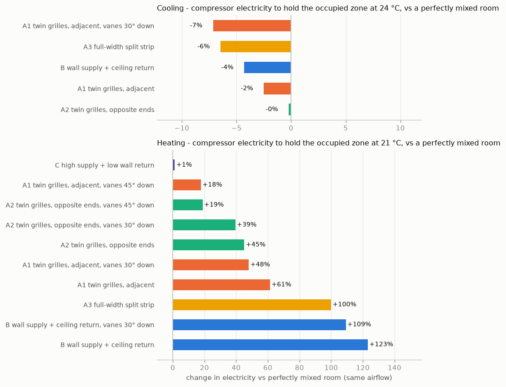
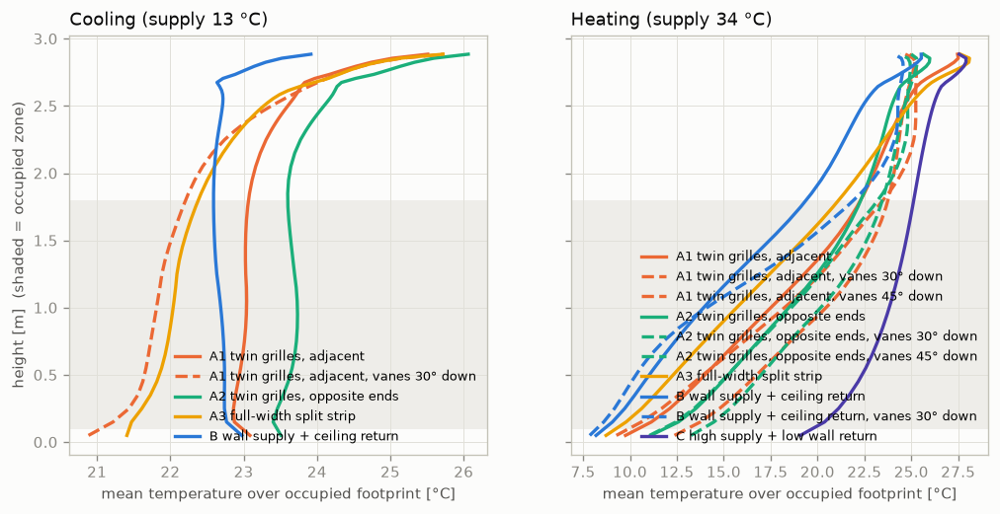

# Living-room ducted AC: same-wall return vs ceiling return (CFD)

These are OpenFOAM simulations of a 4.1 × 4.6 × 2.9 m living room. A ducted reverse-cycle unit (Daikin FDXM35 class, 133 L/s) sits behind one 4.1 m wall. The supply grille is on that wall with its top 150 mm below the ceiling and 120 mm high. The study compares return-grille layouts in both cooling and heating.

## Bottom line

**Cooling.** The pretty option costs almost nothing. Every high-wall return layout performs within about ±3 % of the ceiling return. None of them short-circuits: in every case the return air is *warmer* than the occupied zone. The cold jet falls into the room, and the high return draws in the warm ceiling layer.

**Heating** is where the real cost is. In this model it is dominated by the direction of the supply jet, not by where the return sits. A ceiling return is the *worst* option for heating: the warm jet runs along the ceiling straight into it.

| Layout | Cooling electricity* | Heating electricity* | Heating: ankle / seated-head °C† |
|---|---|---|---|
| **A1** twin grilles side by side (the "pretty" one) | −2 % | +61 % | 10.5 / 18.2 |
| **A1** + supply vanes 30° down | −7 % | +48 % | 9.9 / 19.0 |
| **A1** + supply vanes 45° down | – | **+18 %** | 13.1 / 21.1 |
| **A2** twin grilles at opposite ends (1.3 m gap) | 0 % | +45 % | 11.8 / 19.1 |
| **A2** + vanes 45° down | – | **+19 %** | 13.9 / 20.8 |
| **A3** one full-width strip (half supply, half return) | −6 % (but more cold dumping, ADPI 78) | +100 % | 9.3 / 16.4 |
| **B** wall supply + ceiling return near far wall | −4 % | +123 % | 8.6 / 14.6 |
| **C** high supply + *low* return on the same wall (reference) | – | **+1 %** | 19.7 / 24.0 |

\* This is compressor electricity needed to hold the occupied zone (0.1–1.8 m high) at 24 °C when cooling or 21 °C when heating. It is compared with a perfectly mixed room at the same airflow; negative means better than perfect mixing. The mesh-refinement check shifts these figures by about 1–4 percentage points, so cooling differences under about 3 % are within noise.
† These are heating temperatures at the supply temperature simulated (34 °C, outdoor 7 °C). They show the *shape* of the stratification. The absolute values are exaggerated; see Limitations.

### What this means for your choice

1. **Symmetrical twin high grilles are fine for cooling.** A1 versus the ceiling return is about 2 % in cooling energy, which is inside the model's uncertainty. The short-circuit penalty predicted in the earlier desk study (10–25 %) did not appear. The cold supply jet is heavy: it detaches and sinks well before the return can capture it, and the grille-height plan view shows no direct supply-to-return path.
2. **Separating the grilles helps less than expected.** A2 is about 10 percentage points better than A1 in heating and no better in cooling.
3. **Angling the supply vanes down is the lever that matters in heating.** 30° barely helps, because a 34 °C jet is buoyant and curls back up to the ceiling. **45° is needed** to drive the warm air down to about 1 m. That cut the heating penalty from +61 % to +18 % and raised the occupied zone by 2.5 K. In cooling, 30° down pushed cold air to the floor (ankle 21.1 °C versus 23.0 °C horizontal). **Use horizontal vanes in summer and steep-down vanes in winter**, so adjustable-blade supply grilles are worth specifying.
4. **Don't put the return in the ceiling for this room.** It gives no real cooling benefit and is the worst layout for heating.
5. **The only layout that fixes heating outright is a low return (C).** It is not symmetrical, so it's a real aesthetic trade-off. Only consider it if winter comfort proves poor with 45° vanes.
6. **The thermostat must sense room air, not return air.** With a high return, the return runs 4–7 K warmer than the occupied zone in heating and 0–2.6 K warmer in cooling. A return-air sensor will stop heating long before the room is warm, so use a wall controller or remote sensor in the occupied zone.

## Metrics per case

`results/metrics.json` has every number. The key definitions:

- **ε (temperature effectiveness)** = (T_return − T_supply) / (T_occupied − T_supply). A value of 1 means perfect mixing; below 1 means short-circuit or stratification is penalising the occupied zone.
- **Energy** assumes a fixed load and fixed airflow, and asks what supply temperature holds the occupied zone at the setpoint. That supply temperature is converted to compressor electricity with a constant-Carnot-fraction model:
  - Cooling: evaporator 7 K below supply, condenser at 47 °C.
  - Heating: condenser 8 K above supply, evaporator at 0 °C.
  - Heating also includes the extra envelope loss caused by the hot ceiling layer.
- **ADPI** follows ASHRAE (EDT between −1.7 and +1.1 K, and speed below 0.35 m/s). **ACE** is the air-change effectiveness from the mean age of air.

| case | ε | ankle→1.1 m ΔT (K) | ADPI | T_return − T_occupied (K) |
|---|---|---|---|---|
| cool A1 adjacent | 1.09 | +0.1 | 93 | +0.9 |
| cool A1 adjacent, vanes 30° down | 1.30 | +0.8 | 83 | +2.6 |
| cool A2 separated | 1.01 | +0.3 | 93 | +0.1 |
| cool A3 full width | 1.26 | +0.6 | 78 | +2.4 |
| cool B ceiling | 1.16 | −0.2 | 95 | +1.6 |
| heat A1 adjacent | 0.56 | +7.8 | 23 | +7.4 |
| heat A1, vanes 30° down | 0.57 | +9.1 | 19 | +7.1 |
| heat A1, vanes 45° down | 0.69 | +8.0 | 27 | +4.4 |
| heat A2 separated | 0.61 | +7.3 | 25 | +6.3 |
| heat A2, vanes 30° down | 0.61 | +7.5 | 25 | +6.3 |
| heat A2, vanes 45° down | 0.69 | +6.9 | 30 | +4.4 |
| heat A3 full width | 0.48 | +7.1 | 24 | +9.8 |
| heat B ceiling | 0.36 | +6.0 | 29 | +13.0 |
| heat B ceiling, vanes 30° down | 0.38 | +7.0 | 18 | +12.2 |
| heat C low return | 1.22 | +4.3 | 48 | −2.3 |

Mesh check (grille and ceiling band refined from 30 mm to 15 mm cells) on A1: cooling ε went from 1.09 to 1.07, and heating ε from 0.56 to 0.55.

Flow fields for every case are in `results/slices_*.png`. Each image shows a section through the supply, a cross-section at mid-room, and a plan view at grille height where any short-circuit would be visible.

## Model

- **Solver.** OpenFOAM v2506 `buoyantBoussinesqPimpleFoam` with the RNG k-ε turbulence model. Each case gets a 1000-iteration steady start-up, then 720 s of transient flow. Fields are time-averaged over the last 480 s, which is about 1.2 room air-change periods (V/Q = 411 s). Buoyant room flow is unsteady, and steady-state runs did not converge.
- **Mesh.** 81k hexahedral cells: 0.1 m horizontally, 0.1 m vertically below 2.3 m, and 0.03 m in the top 0.6 m.
- **Supply.** 1.2 m × 60 mm effective slot, representing a 120 mm grille at 50 % free area, so jet momentum is correct. That gives 1.85 m/s at 13 °C in cooling or 34 °C in heating. The A3 full-width strip uses 1.9 m, giving 1.17 m/s.
- **Cooling loads, 1.8 kW sensible, fixed:** 1.0 kW sun-exposed far wall, 0.4 kW solar patch on the floor, 0.15 kW roof, 0.25 kW people and equipment.
- **Heating losses:** UA × (T_local − 7 °C), with UA = 121 W/K, equal to 1.7 kW at 21 °C. Of this, 57 W/K is on the far/window wall; the rest is split between the side walls, floor and ceiling.
- **Age of air** is solved as a passive scalar.

Reproduce with: `python3 make_cases.py && for c in cases/*/; do $c/Allrun; done && python3 analyse.py`. About 25 CPU-hours in total.

## Limitations

- **No radiation, and walls have no thermal mass.** In heating, a real warm ceiling radiates to the floor and people, and surfaces exchange heat radiatively. That substantially reduces stratification. The absolute heating numbers (ankle 9–14 °C, +45–120 % energy) are therefore overstated, plausibly by 1.5–2×. The **ranking** is driven by jet and return geometry and should be robust: ceiling return worst, 45° vanes much better than 30°, low return best. Cooling is less affected.
- **Heating supply temperatures above about 45–50 °C** (cases B and A3) can't actually be delivered by the unit. In practice those layouts simply wouldn't reach 21 °C at head height, rather than using that much more energy.
- **Averaging window.** It is about one air-change period long. The return-air signal fluctuates by ±0.5 K in cooling, and the energy-balance residual is at most 0.5 K. Treat cooling differences under about 3 % as noise.
- **Fixed airflow at the nominal fan speed.** An inverter unit on high fan throws further, which helps heating penetration.
- **Idealised geometry:** an empty room with no furniture, doors or windows modelled explicitly.
